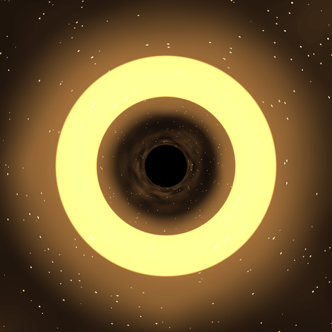

# Black hole GPU renderer

A small, one-day passion project from August 2026, adapting my earlier
Java/JavaFX black-hole simulator into a Python/Taichi GPU ray tracer.
The main implementation session was August 21, following initial setup
on August 20. Later commits include documentation and code organization.
This was a bounded learning project, not a sustained research project or
a production renderer.

It integrates Schwarzschild null geodesics per pixel with RK4 and uses
a mouse-controlled 3D camera to display gravitational lensing. Taichi
selects a GPU backend, such as CUDA or Vulkan, depending on the machine.

## Demo



[Full-resolution MP4](docs/demo.mp4) · 640 × 640, six-second loop.
Captured from the unchanged renderer on CUDA using a scripted camera path
(distance 80 to 55 Schwarzschild radii and back, with a small look-around).
Video playback is 30 fps; this is not an interactive-performance benchmark.
The bright ring is the lensing of the procedural background light source,
not an accretion disk.

The capture script and demo packaging were added by Codex in September 2026;
they are separate from the original one-day project and its Claude Code
attribution below. To reproduce the frames in the project's environment:

```bash
python scripts/capture_demo.py /tmp/blackhole-frames --frames 180
ffmpeg -framerate 30 -i /tmp/blackhole-frames/%04d.png -c:v libx264 -crf 19 -pix_fmt yuv420p -movflags +faststart demo.mp4
```

## Authorship and Claude Code assistance

I built this with substantial help from Claude Code. The division of work:

- **Implemented by me:** the RK4 integration skeleton and angular derivative
  ported from my Java code, the original 2D camera, and most of the free
  3D camera implementation, including per-pixel rays, orbital-plane
  reduction and exit-direction reconstruction.
- **Explained or derived by Claude, implemented by me:** the corrected
  radial equation, pinhole-camera geometry and the idea of reducing each
  ray to a 2D orbital plane. Claude identified many bugs during iteration;
  I implemented the fixes.
- **Written directly by Claude:** the procedural starfield and light
  sources, the camera-distance clamp and the corrected pitch/yaw formula.
  Claude also ran the headless shadow-boundary check and handled some
  commits.

The contemporaneous [session log](SESSION_LOG.md) records the detailed
split, including debugging assistance. Commit authorship alone does not
represent who wrote or conceived each part of the implementation.

## Run

Use Python 3.12 and a working graphics driver. From the repository root:

```bash
python3.12 -m venv .venv
source .venv/bin/activate
pip install -r requirements.txt
python src/render.py
```

On Windows, activate with `.venv\Scripts\activate` instead.
Left-drag to change the view; scroll to zoom. The optional
`python src/hello_gpu.py` script checks the GPU/window setup.

## Scope and limitations

The completed scope is a single-black-hole lensing demo with an interactive
camera. The shadow boundary was checked against the analytic critical
impact parameter; this does not validate the full distortion field.
The fixed integration budget can be exhausted at large camera distances,
and close-camera initial conditions have not been fully validated.
Multiple black holes, an accretion disk and other extensions are outside
the completed scope.

[INSTRUCTIONS.md](INSTRUCTIONS.md) is the original development plan and
contains outdated setup, hardware and phase-status notes. Use this README
for the current project description and run instructions.
